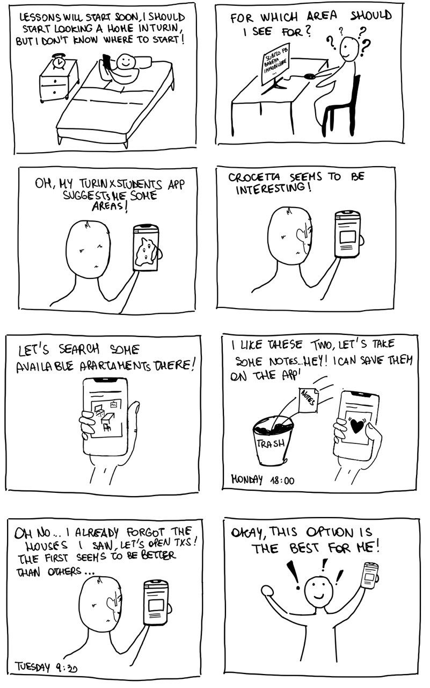
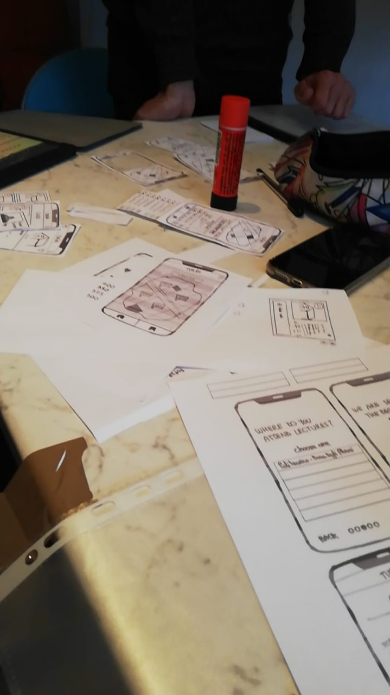
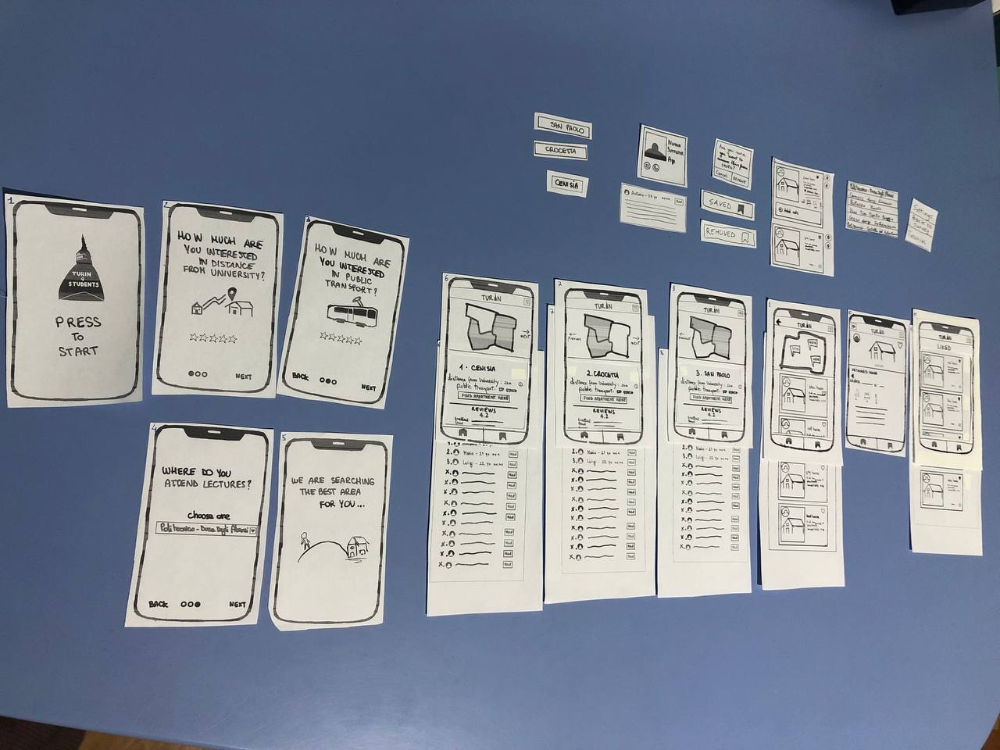
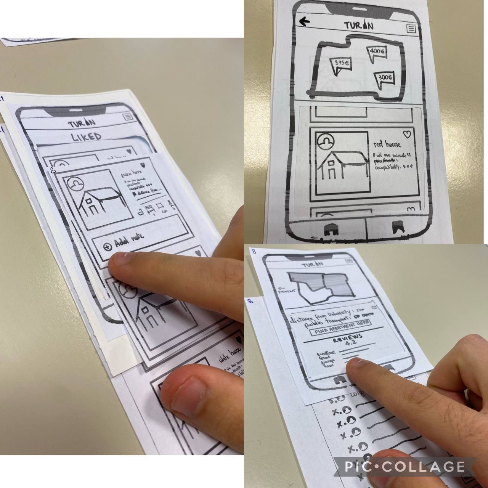
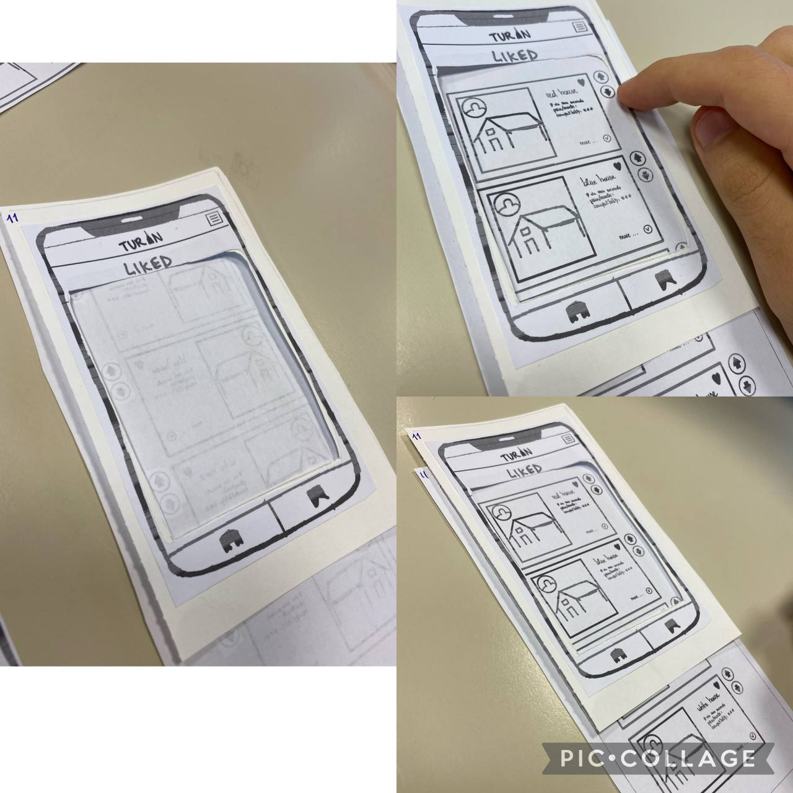

# Milestone 2: Prototyping and Heuristics - [TurinXStudents]

## Storyboards
>

We chose this storyboard to show a common problem for a student coming in Turin that is searching an apartment to live. In particular, she doesn't know exactly **in which area** to search in and where get useful information about that: this problem leads to a confusionary research and consequently she will spent an huge amount of time. For this reason it's difficult to **remember** all the houses seen that she liked.

The storyboard illustrates the aim of our application which is showing students some solutions that best fit their preferences and giving them the possibilities to save the potential apartments. The strong point of our storyboard is that if who read the storyboard has already searched at least once an house or an apartment, he will impersonate the man in the storyboard and so he will understand the feel of loss and the difficulty of remembering the solution found.
On the contrary, the weak point of our storyboard is the difficulty to **understand how** our application suggests the best areas for the user **based on her preferences and lifestyle**.

Lastly, in light of what has been said, the user can clearly see from the storyboard that he will be able to understand how to satisfy his needs in a fast and practical way. Since the main issue is finding the best area to live and an apartment in that area, our storyboard perfectly fits this goal.

## Paper Prototypes
Both prototypes, as said in the project description and illustrated in the storyboard, aims the same objective that is suggesting the best area to live in Turin and find an apartment there. First of all, user is asked to complete a **survey** at first usage of the application, providing useful information about her preferences and where she is attending or will attend lectures. Then the app will **display** a sorted list of potential areas, based on the data acquired in the previous steps. At this point, the user has the possibility to see structured announces related to the selected area, posted by Turin's owners and in case **contact** them. Lastly, it's possible to **save** potential apartments in order to examine them in a second moment and choose the favourite ones.
 
This choices are declined in a different way.

### PROTOTYPE 1

(See "Prototype1.pdf" https://github.com/polito-hci-2021/TurinXStudents/blob/main/M2/Prototype1.pdf)

1. **Survey**

This prototype asks user preferences and where she will attend lectures by means of a survey which the user has to do at the first use of the application. We only put 3 questions in the paper prototype to give an example but they are supposed to be more than 3 showed in the same way. 

2. **Display solutions**

Based on user preferences, this prototype focuses on guiding the user during the navigation through a map which is always visible in the different screens, avoiding that the user uses other apps to search more information.
In particular, in the screen with different areas the map helps the user to localize the suggested areas with respect to the rest of the city. 
In the screen of the apartments available in the selected area, it is dynamically showed the location of the current house, scrolling the list of solutions.

3. **Contact owner**

Furthermore in this prototype we give the user the possibility to have information about the owner and his main contacts so the user has the possibility to a direct contact with her. 

4. **Saved**

Saved solutions can be consulted and compared through a custom note in which the user can summarize important information for herself.

### PROTOTYPE 2

(See "Prototype2.pdf" https://github.com/polito-hci-2021/TurinXStudents/blob/main/M2/Prototype2.pdf)

1. **Survey**

This prototype asks the user where she will attend lectures and her preferences by means of a list which she has to reorder, at the first use of the application. We only put some preference examples in the paper prototype but they are supposed to be more.

2. **Display solutions**

Based on user preferences, this prototype focuses on providing results to her through a list. This is the pattern used both for giving the result of the areas and the houses in the specific area. To give an idea about the selected area, in this prototype are showed some pictures.

3. **Contact owner**

In this prototype the user has to fill a form with his information and a short message in order to ask the owner to contact her.

4. **Saved**

Saved solutions can be consulted and compared through a list sorted by the user.

## Heuristic Evaluation

### Preparation and materials
(See "Prototype1.pdf" and "Prototype2.pdf")

We initially designed the paper prototype on the tablet, then printed and sorted with the related components to carry out the evaluation.

### Evaluation description and photos
Initially the facilitator gave a short introductory description of our app and the functionalities implemented. 
Then he gave evaluators complete freedom to explore the prototypes in order to understand if every single action was visible and intuitive. If something was hard to understand, the facilitator gave some suggestions in order to complete the task.
At the end of the evaluation, the facilitator asked the evaluator to perform any missing action that he didn't see or didn't try. 
The evaluation ends with a general feedback from the evaluator.

**Prototype 1**
 
* *The left picture refers to Issue#2*
* *The bottom right one concerns an advice given by the evaluator, about adding the functionality to filter reviews.*
  

**Prototype 2**

* *The left picture concerns an advice given by the evaluator, about adding an alert if no apartment announce is present in liked section.*
* *The up rigth one is about the worries of evaluator on the sort method (arrows) and the effective necessity to reorder liked houses.*

### Evaluation results
The group that helps us to conduct the evaluation was "roll4initiative". The results of the evaluation can be found in this link:  https://docs.google.com/spreadsheets/d/1S75rYEZPU5JINgfclM5t1gLZNIySfdLq7Hgqmbk4Y4Q/edit#gid=0

### Potential changes
We chose prototype number 1 because it was the most appreciated by the evaluators. In fact the experience of the evaluators in the first prototype was more intuitive and fluid, while in the second one there were more perplexities.
The strength of this prototype is the presence of a map that allows the user to visualize in each moment the area suggested or the apartments liked. This help the user to orient himself easily in the city. 
On the other hand, the weakness of prototype 2 is the way by which the user expresses her preferences. In fact, in this case the user is forced to give a priority to all the options listed even if she might consider two or more voices equally.

Based on the issues reported by evaluators, possible changes are:
* Issue #1: 

> The answers in the survey are based on a "5 stars" rating system. There's a problem in quantifying a "star" when referring to measures such as distance. And which is the difference between the stars? It's not very clear

Our idea was not to quantify the distance from university, but to quantify the interest of the user in the proximity to the university.
So we chose to change the text of the question in "How much are you interested in being close to the university?"

* Issue #2: 

> When you want to add note in the house "card" a plus button is displayed, but only one note is possible.

We didn't mean to draw a button to add another note field but the idea is to have a simple text area with a placeholder "Add a note..." so there will be no button but just a text field. We will also add a save button in order to store the note.

* Issue #3: 

> When the list of users' comment are displayed, the button "find apartement here" is positioned in the top of the page, instead of being always visible even when you scroll down.

We will definetely fix this problem by using a fixed-bottom button on the screen so that it can be clicked even when scrolling the reviews.

* Issue #4: 

> An arrow is used to see more details about an apartment, but it's not displayed how to close this section.

We will add a button to close the section to see more details about an apartment.

### Other changes

We will also make other changes in prototype 1 inspired by some details of prototype 2:

- we will change heart shaped icon in each screen, with the bookmark one that matches the second icon in the footer of our app. We will do this in order to keep consistence in the application. 

- we decide to represent the "total compatibility" of the area near his name instead of in the apartment list of an area and expressing it in term of percentage (like in the second prototype) because it is more understandable. We will report the same value in the list of saved since there there will be apartments coming from different areas.
