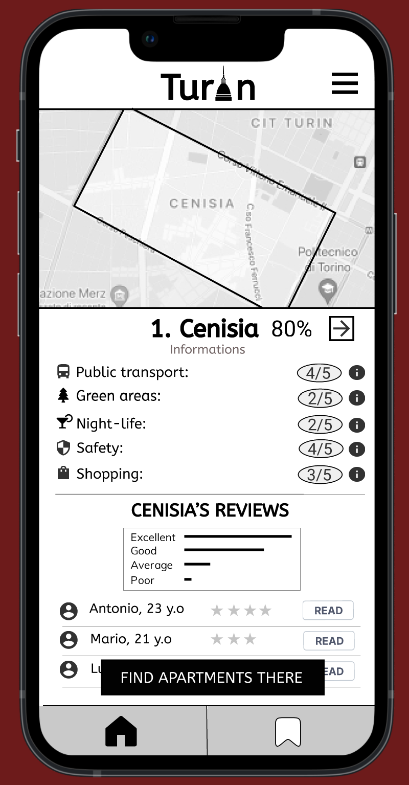
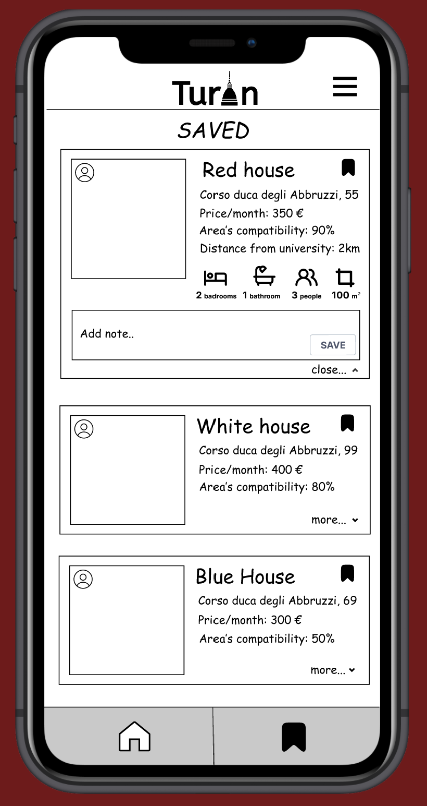

 # Milestone 3: Wireframe - [TurinXStudents]

## Wireframe

#Homepage             |  #SavedPage 
:-------------------------:|:-------------------------:
|  |  

We chose to use Figma to create the wireframes because its usage makes the process of designing and building prototypes easy. The strength of Figma is the possibility to have a preview of the final result in a specific mobile device and work on it at the same time.

We started the design of the two wireframes by recreating the first paper prototype from M2 with higher quality and with all the changes we planned to introduce after the evaluation results. About the improvement of the first paper prototype, we chose to substitute the icon used to save the liked solutions found.
Since we have better defined the questionnaire, we decided to add more information about the area correlated to the ones retrieved by the questions in the questionnaire. This information (night life, green areas, safety, shopping), in our opinion, regards the most important aspects of an area.
In this way, the user can find the compatibility in the area with the preferences he gave.
Furthermore we decided to delete the information about the distance of the area from university since we realized that it's not a really precise and meaningful measure. We left this information in the single apartment page.
The last improvement that we did is linked to the position of the button to find an apartment: now it is fixed to the bottom, so the user can click whenever she wants even when she is scrolling reviews.

We chose as second wireframe the "Saved" page since it's the other important feature we decided to implement, in addiction to "find a place".
In fact our application firstly aims to show the best areas to live and apartments there, and then gives the user the possibility to compare and keep in mind solutions liked. For these reasons, this page is quite central in the design of our system and, consistently, our app will have two buttons on the bottom: one for the homepage and one for the "Saved" page. 
