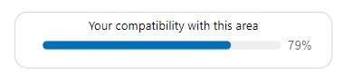
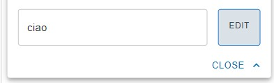
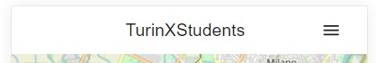

# Milestone 4: Usability Testing - [TurinXStudents]

## Overview and Script

We conducted the usability test with three students among our target population.
* With the **first** student we did the test in an online meeting with shared screen. The participant was sharing the screen with our app running on Chrome using developer tools, setting iPhone XR screen dimensions.
* With the **second** we had our facilitator in the room helping her, while the rest of the team was following the test in an online meeting. A smartphone was used, connected to our pc on localhost.
* We followed the the same methodology of the first user for the **third** partecipant, but also with our facilitator in the room.

The plan of the usability test and the script used is described in this file: https://github.com/polito-hci-2021/TurinXStudents/blob/main/M4/UsabilityTestingProtocol.pdf

## Results and List of Changes

## Result obtained

### Time to complete to task 

#Time to complete to task |           #Participant 1 - Mario             |   #Participant 2 -Viola   |   #Participant 3 - Matteo   |          Average
:-------------------------:|:-------------------------:|:-------------------------:|:-------------------------:|:-------------------------:
T1|79s|75s|60s|71s
T2|153s|63s|40s|85s
T3|30s|50s|12s|31s
T4|10s|11s|9s|10s
T5|40s|40s|70s|54s
T6|6s|5s|10s|7s
T7|3s|9s|6s|6s
T8|20s|22s|21s|21s
T9|10s|5s|22s|12s

### Completion rates

Completion rates |           Participant 1 - Mario             |   Participant 2 -Viola   |   Participant 3 - Matteo   |          Average
:-------------------------:|:-------------------------:|:-------------------------:|:-------------------------:|:-------------------------:
T1| 100%| 100%| 100%| 100%
T2| 100%| 100%| 100%| 100%
T3| 100%| 100%| 100%| 100%
T4| 100%| 100%| 100%| 100%
T5| 100%| 100%| 100%| 100%
T6| 100%| 100%| 100%| 100%
T7| 100%| 100%| 100%| 100%
T8| 100%| 100%| 100%| 100%
T9| 100%| 100%| 100%| 100%

### Number of errors

Number of errors |           Participant 1 - Mario             |   Participant 2 - Viola   |   Participant 3 - Matteo   |          Average
:-------------------------:|:-------------------------:|:-------------------------:|:-------------------------:|:-------------------------:
T1| /| /| /| 0
T2| /| /| /| 0
T3| /| /| /| 0
T4| /| /| Non critical: he saved the second apartment instead of the first one, but then he recovered from his error.| 0.33
T5| /| /| /| 0
T6| /| /| /| 0
T7| /| /| /| 0
T8| /| /| /| 0
T9| /| /| Non critical: he clicked on the right icon but he didn't get that 'Back to Survey' meant redoing the questionnaire. He explored again the app and at the end clicked on the button. | 0.33

### SUS score
Participant 1  - Mario   |   Participant 2 -Viola   |   Participant 3 - Matteo   
:-------------------------:|:-------------------------:|:-------------------------:
92.5| 77.5| 70|

### Evaluation results and findings
Within the usability test we conducted, we obtained some interesting feedback from the participants and we decide to implement some changes to cover most of the problems emerged.

1. [First and second participants] The first feedback we received was about the questionnaire and the shopping question. They were doing task 1 with the think-aloud methodology and they were incertain about the question "How much are you interested in shopping?" because they couldn't get if it was about supermarket or other kind of shops.
2. [First and third participants] Another problem emerged from task 1 was that the button used to select the university. This didn't really give the impression of a multiple selection button. They said that he wasn't expecting a list of choices once clicked on the button.
3. [First participant] While doing task 2 he couldn't understand the meaning of the percentage close to the area name (compatibility).
4. [All participants] While doing task 5 our participants saved a note but they said that they weren't sure if the note was saved.
5. [Third participant] About doing task 9 he said that he wasn't sure about the meaning of the menu voice "Back to survey".

At the end of the test we received some comments and advice from our participants.
6. [First participant] In task 5 again, a partecipant said that he preferred "edit" button instead of "save" when a note was already saved. 
7. [Second participant]  Add the name of the area in the button "Search apartment there".
8. [First participant] According to the participant the hamburger icon wasn't the right one for the kind of menu we were showing.

#### Positive feedback
Our participants reported also satisfaction about the general ease of use of the app, about the "saved" feature and about the initial questionnaire to provide personal preferences. In particular, they appreciated a lot and considered helpful the questions in the survery in order to suggest the best areas for them.

### Partecipants 

#First            |  #Second | #Third
:-------------------------:|:-------------------------:|:-------------------------:
  |  |  |
Issue #3| Issue #4 |Issue #5

### List of potential changes
1. Changed the shopping image with another one that does not represent a cart (supermarket) but some shopping bags. 
2. Changed university selection button to a more intuitive and standard select item.
3. Compatibility percentage as a linear progress bar, with "success" color to underline the positivitity of this attribute and the label to describe his meaning.
4. Added animation of the snackbar to report action done to the user when saving or editing a note in order to make it more visible.
5. Changed menu voice from "Back to survey" to "Redo questionnaire" for the sake of clearness.
6. Button "save" note was changed to "edit" after the note is saved. 
7. The button "Search apartment there" changed in "Search apartment in <Area_Name>"
8. Hamburger icon changed with vertical three dots beacause it's a more standard icon for that kind of menu.
 

#Change |            #Before            |  #After
:-------------------------:|:-------------------------:|:-------------------------:
| Shopping Image |   |  
| University selection |    |  
| Compatibility percentage |  |  
| "Back to survey"|    |   
| Button save note |    |   
| Button "Search apartment there" |    |   
| Hamburger icon |    |   

